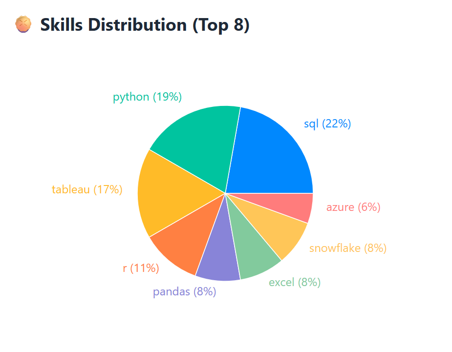
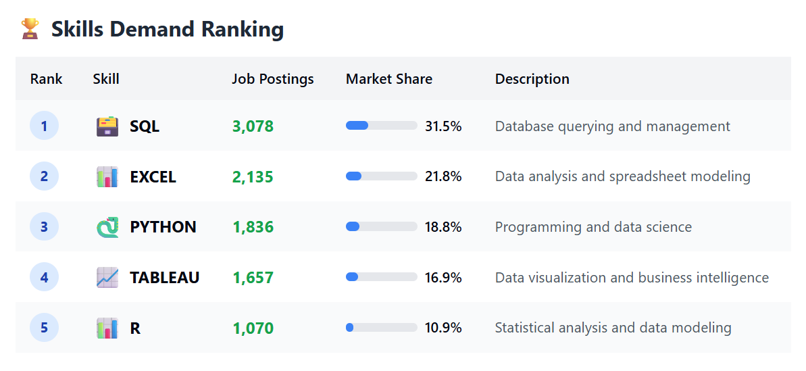

# Introduction

🚀 Step into the world of data careers! This project shines a spotlight on Data Analyst roles, uncovering the best-paying opportunities,  must-have skills, and the sweet spot where demand and salary align.

 All insights are powered by SQL — dive into the queries here: [project_sql folder](/project_sql/)

# Background
This project was inspired by the challenge of understanding the data analyst job market. By identifying the most valuable skills and highest-paying opportunities, it aims to simplify the job search process and provide clear insights for anyone pursuing a career in data analytics.

### The questions I wanted to answer through my SQL queries were:

1. What are the top-paying data analyst jobs?
2. What skills are required for these top-paying jobs?
3. What skills are most in demand for data analysts?
4. Which skills are associated with higher salaries?
5. What are the most optimal skills to learn?

# Tools I Used

To explore the data analyst job market, I relied on a set of powerful tools that made analysis and organization seamless:

- **SQL**: My main instrument for digging into the data and uncovering trends.

- **PostgreSQL**: A reliable database engine to store, manage, and query job postings.

- **Visual Studio Code**: The workspace where I wrote and tested my SQL queries efficiently.

- **Git & GitHub**: Keeping everything versioned, organized, and shareable for collaboration and future reference.

# The Analysis

Each SQL query in this project explores a different aspect of the data analyst job market, from salary insights to in-demand skills. Below is a detailed breakdown of the analysis and findings.

## 1. Top-Paying Data Analyst Jobs

To uncover the highest-paying opportunities, I filtered Data Analyst roles by average yearly salary and focused on remote-friendly positions. This analysis highlights lucrative career options and the companies offering them.

```sql

-- Enhanced filter version for 2023, full-time remote positions with valid salaries
SELECT
    jp.job_id,
    jp.job_title,
    jp.job_location,
    jp.job_schedule_type,
    jp.salary_year_avg,
    jp.job_posted_date,
    c.name AS company_name
FROM
    job_postings_fact jp
LEFT JOIN company_dim c 
    ON jp.company_id = c.company_id
WHERE
    jp.job_title_short = 'Data Analyst'  
    AND (jp.job_location ILIKE '%Anywhere%' 
         OR jp.job_location ILIKE '%Remote%' 
         OR jp.job_location ILIKE '%Work from Home%') 
    AND jp.salary_year_avg IS NOT NULL
    AND jp.salary_year_avg > 20000
    AND jp.job_schedule_type = 'Full-time'
    AND jp.job_posted_date >= '2023-01-01'
ORDER BY
    jp.salary_year_avg DESC
LIMIT 10;
```

### Key Insights from 2023 Top Roles:

- **High Salary Potential:** The top-paying data analyst roles range from $184,000 to $650,000, showing significant earning opportunities.

- **Diverse Employers:** Companies such as SmartAsset, Meta, and AT&T feature among the top, reflecting demand across different industries.

- **Varied Job Titles:** Positions range from Data Analyst to Director of Analytics, highlighting a variety of responsibilities and career levels.


*"Average Salary by Top 10 Highest-Paying Skills for Data Analysts"*

## 2. Skills for Top-Paying Jobs

To identify the key skills required for the highest-paying data analyst roles, I joined the top-paying job postings with the skills data. This analysis highlights which technical and analytical abilities employers prioritize when offering high salaries.

```sql
WITH top_paying_jobs AS (
    SELECT
        jp.job_id,
        jp.job_title,
        jp.job_location,
        jp.job_schedule_type,
        jp.salary_year_avg,
        jp.job_posted_date,
        c.name AS company_name
    FROM
        job_postings_fact jp
    LEFT JOIN company_dim c 
        ON jp.company_id = c.company_id
    WHERE
        jp.job_title_short = 'Data Analyst'  
        AND (jp.job_location ILIKE '%Anywhere%'   
             OR jp.job_location ILIKE '%Remote%'     
             OR jp.job_location ILIKE '%Work from Home%') 
        AND jp.salary_year_avg IS NOT NULL 
        AND jp.salary_year_avg > 20000 
        AND jp.job_schedule_type = 'Full-time'
        AND jp.job_posted_date >= '2023-01-01'
    ORDER BY
        jp.salary_year_avg DESC
    LIMIT 10
)

SELECT 
    top_paying_jobs.*,
    skills
FROM    
    top_paying_jobs
INNER JOIN skills_job_dim
    ON skills_job_dim.job_id = top_paying_jobs.job_id
INNER JOIN skills_dim 
    ON skills_dim.skill_id = skills_job_dim.skill_id;
    
```
### Key Insights from Top-Paying Roles:

- **SQL** is the most sought-after skill, appearing in 8 of the top 10 jobs.

- **Python** is highly valued as well, featured in 7 postings.

- **Tableau** remains popular, with a presence in 6 roles.

- **Other** in-demand skills include R, Snowflake, Pandas, and Excel, reflecting a broad technical toolkit required for high-paying roles.


*"Pie chart visualizing the count of skills for the top 10 paying jobs for data analysts"*

## 3. In-Demand Skills for Data Analysts

This analysis identifies the most frequently requested skills in data analyst job postings, highlighting what employers value most and where job seekers should focus their skill development.
```sql
SELECT
    s.skills,
    COUNT(*) AS demand_skills_count
FROM
    job_postings_fact jp
INNER JOIN skills_job_dim sj 
    ON jp.job_id = sj.job_id
INNER JOIN skills_dim s 
    ON sj.skill_id = s.skill_id
WHERE
    jp.job_title_short = 'Data Analyst'
    AND jp.job_posted_date >= '2023-01-01'
    AND jp.job_schedule_type IS NOT NULL
    AND jp.company_id IS NOT NULL
    AND jp.salary_year_avg IS NOT NULL  
--  AND jp.job_work_from_home = True 
GROUP BY
    s.skills
ORDER BY
    demand_skills_count DESC
LIMIT 5;
```

### Key Insights for 2023:

- **SQL and Excel** continue to be fundamental skills, reflecting the importance of data processing and spreadsheet manipulation.

- **Programming and visualization tools** such as **Python, Tableau, and Power BI** are increasingly critical, highlighting the growing demand for technical skills in data storytelling and decision support.


*"the demand for the top 5 skills in data analyst job postings"*

## 4. Skills Based on Salary
This query explores **which skills are associated with the highest average salaries for Data Analyst roles**, helping identify the most financially rewarding capabilities.
```sql
SELECT
    s.skills,
    ROUND(AVG(salary_year_avg),0) AS avg_salary
   
FROM
    job_postings_fact jp
INNER JOIN skills_job_dim sj 
    ON jp.job_id = sj.job_id
INNER JOIN skills_dim s 
    ON sj.skill_id = s.skill_id
WHERE
    jp.job_title_short = 'Data Analyst'
    AND jp.job_posted_date >= '2023-01-01'
    AND jp.job_schedule_type IS NOT NULL
    AND jp.company_id IS NOT NULL
    AND jp.salary_year_avg IS NOT NULL  
    AND job_work_from_home = True --work remotely
    
GROUP BY
    s.skills
ORDER BY
    avg_salary DESC
LIMIT 25;
```
### Key Insights:

- **High-Paying Big Data & ML Skills:** Analysts with expertise in big data tools (PySpark, Couchbase), machine learning platforms (DataRobot, Jupyter), and Python libraries (Pandas, NumPy) command the top salaries, emphasizing the value of advanced data processing and predictive modeling capabilities.

- **Software Development & Deployment Skills:** Knowledge of development and deployment tools (GitLab, Kubernetes, Airflow) shows that combining data analysis with engineering and automation skills is highly lucrative.

- **Cloud Computing Proficiency:** Familiarity with cloud and data engineering environments (Elasticsearch, Databricks, GCP) is increasingly important, indicating that cloud expertise can significantly boost earning potential in data analytics.

| skills        | avg_salary  |
| ------------- | ----------- |
| pyspark       | 208172      |
| bitbucket     | 189155      |
| watson        | 160515      |
| couchbase     | 160515      |
| datarobot     | 155486      |
| gitlab        | 154500      |
| swift         | 153750      |
| jupyter       | 152777      |
| pandas        | 151821      |
| elasticsearch | 145000      |
| golang        | 145000      |
| numpy         | 143513      |
| databricks    | 141907      |
| linux         | 136508      |
| kubernetes    | 132500      |
| atlassian     | 131162      |
| twilio        | 127000      |
| airflow       | 126103      |
| scikit-learn  | 125781      |
| jenkins       | 125436      |
| notion        | 125000      |
| scala         | 124903      |
| postgresql    | 123879      |
| gcp           | 122500      |
| microstrategy | 121619      |

*"Table of the average salary for the top 10 paying skills for data analysts"*

## 5. Most Optimal Skills to Learn

By combining insights from skill demand and average salary, this analysis identifies the skills that are both highly sought-after and financially rewarding. This helps data analysts prioritize which skills to focus on for maximum career impact.

```sql 
WITH skills_demand AS (
    SELECT 
        s.skill_id,
        s.skills,
        COUNT(*) AS demand_skills_count
    FROM job_postings_fact jp
    INNER JOIN skills_job_dim sj ON jp.job_id = sj.job_id
    INNER JOIN skills_dim s ON sj.skill_id = s.skill_id
    WHERE 
        jp.job_title_short = 'Data Analyst'
        AND jp.job_posted_date >= '2023-01-01'
        AND jp.job_schedule_type IS NOT NULL
        AND jp.company_id IS NOT NULL
        AND jp.salary_year_avg IS NOT NULL
        AND jp.job_work_from_home = TRUE
    GROUP BY 
        s.skill_id, s.skills
),

skills_salary AS (
    SELECT 
        s.skill_id,
        ROUND(AVG(jp.salary_year_avg), 0) AS avg_salary
    FROM job_postings_fact jp
    INNER JOIN skills_job_dim sj ON jp.job_id = sj.job_id
    INNER JOIN skills_dim s ON sj.skill_id = s.skill_id
    WHERE 
        jp.job_title_short = 'Data Analyst'
        AND jp.job_posted_date >= '2023-01-01'
        AND jp.job_schedule_type IS NOT NULL
        AND jp.company_id IS NOT NULL
        AND jp.salary_year_avg IS NOT NULL
        AND jp.job_work_from_home = TRUE
    GROUP BY 
        s.skill_id
)

SELECT 
    skills_dim.skill_id,
    skills_dim.skills,
    COUNT(skills_job_dim.job_id) AS demand_count,
    ROUND(AVG(job_postings_fact.salary_year_avg), 0) AS avg_salary
FROM job_postings_fact
INNER JOIN skills_job_dim 
    ON job_postings_fact.job_id = skills_job_dim.job_id
INNER JOIN skills_dim 
    ON skills_job_dim.skill_id = skills_dim.skill_id
WHERE
    job_postings_fact.job_title_short = 'Data Analyst'
    AND job_postings_fact.job_posted_date >= '2023-01-01'
    AND job_postings_fact.job_schedule_type IS NOT NULL
    AND job_postings_fact.company_id IS NOT NULL
    AND job_postings_fact.salary_year_avg IS NOT NULL
    AND job_postings_fact.job_work_from_home = TRUE
GROUP BY 
    skills_dim.skill_id, skills_dim.skills
HAVING 
    COUNT(skills_job_dim.job_id) > 10
ORDER BY 
    avg_salary DESC,
    demand_count DESC
LIMIT 25;
```

### Key Takeaways:

- **High-Demand Programming Languages:** **Python and R** remain highly sought-after (demand counts 236 and 148 respectively). While their salaries are slightly lower than niche cloud or big data skills, these languages remain critical for career growth.

- **Cloud Platforms & Big Data Technologies:** Skills like Snowflake, **Azure, AWS, and BigQuery** show both strong demand and high average salaries, highlighting the value of cloud and big data expertise.

- **Business Intelligence & Visualization Tools:** Tools like **Tableau and Looker**demonstrate significant impact on employability and earning potential, emphasizing the importance of effective data visualization.

- **Database Technologies:** Both traditional and NoSQL databases **(Oracle, SQL Server, NoSQL)** are still essential, reflecting the ongoing need for robust data storage, management, and retrieval skills.

| skill\_id | skills     | demand\_count | avg\_salary |
| --------- | ---------- | ------------- | ----------- |
| 234       | confluence | 11            | 114210      |
| 8         | go         | 26            | 113698      |
| 97        | hadoop     | 22            | 113193      |
| 80        | snowflake  | 37            | 112948      |
| 74        | azure      | 34            | 111225      |
| 77        | bigquery   | 13            | 109654      |
| 76        | aws        | 32            | 108317      |
| 4         | java       | 17            | 106906      |
| 194       | ssis       | 12            | 106683      |
| 233       | jira       | 20            | 104918      |
| 185       | looker     | 49            | 103795      |
| 79        | oracle     | 36            | 103062      |
| 20        | nosql      | 13            | 101414      |
| 1         | python     | 236           | 101397      |
| 5         | r          | 148           | 100499      |
| 78        | redshift   | 16            | 99936       |
| 187       | qlik       | 13            | 99631       |
| 182       | tableau    | 229           | 99407       |
| 92        | ssrs       | 14            | 99171       |
| 93        | spark      | 32            | 99077       |
| 113       | c++        | 11            | 98958       |
| 186       | sas        | 63            | 98902       |
| 7         | sas        | 63            | 98902       |
*"Table of the most optimal skills for data analyst sorted by salary"*

# What I Learned

Starting SQL for the very first time through the Luke Barousse course while also being part of the DEPI program has been a game-changer for me. This project wasn’t just about writing queries—it was about building my foundation as a data analyst step by step:

- **First Steps in SQL:** Learned how to structure queries, filter data with WHERE, and connect multiple tables—things that once looked intimidating now feel like natural tools.

 - **Data Exploration Mindset:** Discovered how SQL isn’t just about coding, but about asking the right questions and translating them into queries that uncover insights.

 - **Hands-On Experience:** Through real-world job market data, I got to practice using SQL for meaningful analysis, not just toy examples.

- **Building Confidence:** Moving from zero SQL knowledge to being able to craft queries with JOINs, GROUP BY, and even CTEs showed me how much progress I can make when learning by doing.

This first project gave me the confidence that SQL isn’t just a technical skill—it’s a powerful lens for answering business questions and uncovering opportunities.

# Insights

The analysis revealed several key takeaways about the data analyst job market:

**1.Highest-Paying Roles:** Remote data analyst positions can reach impressive salaries, with the top offers climbing up to $650K.

**2.Skills Behind Top Salaries:** SQL consistently appears in high-paying job postings, proving its importance for analysts aiming at top-tier compensation.

**3.Most Requested Skills:** Employers prioritize SQL, Excel, Python, Tableau, and Power BI, cementing them as the core toolkit for analysts.

**4.Premium Skills for Salary Growth:** Advanced and niche tools like PySpark, Solidity, and cloud platforms drive salaries higher, highlighting the value of specialization.

**5.Best Skills for Market Competitiveness:** SQL stands out as the most strategic skill—high in demand and well-compensated—making it a cornerstone for maximizing career opportunities.

# Closing Thoughts

This project gave me my first real experience applying SQL to explore the data analyst job market. I discovered how crucial SQL is—not only the most in-demand skill but also tied to higher salaries. At the same time, niche tools like PySpark and Solidity showed the value of specialization. Overall, I strengthened my SQL skills and gained clear insights into how data shapes career opportunities.